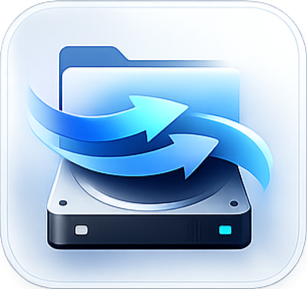

<p align="center">
  
</p>

<h1 align="center">MacNTFS</h1>

<p align="center">
  <strong>EN</strong> — Native macOS app for full NTFS read/write support on external drives.<br>
  <strong>ES</strong> — Aplicación nativa de macOS para lectura y escritura completa en discos externos NTFS.
</p>

<p align="center">
  
  
  
  
</p>

---

## English

### The Problem

macOS detects NTFS-formatted drives (Windows) but mounts them as **read-only**. You can see your files but can't modify, copy to, or delete anything. The alternatives are reformatting the drive (losing all data) or buying expensive commercial software.

### The Solution

MacNTFS re-mounts NTFS drives with full write support using `ntfs-3g` and `macFUSE`. One click — no reformatting, no data loss. Your drive remains fully compatible with Windows.

### Features

| Feature | Description |
|---------|-------------|
| **Auto-detection** | Detects external drives instantly when connected via USB or hub |
| **NTFS identification** | Identifies filesystem type and highlights NTFS drives with visual status |
| **One-click R/W mount** | Re-mounts NTFS drives with full write support via ntfs-3g |
| **Built-in file manager** | Browse, copy, move, rename, and delete files with drag-and-drop support |
| **Search** | Real-time search to find files on large drives |
| **Breadcrumb navigation** | Clickable path segments to jump between folders |
| **Progress tracking** | Visual progress bar for large file copy operations |
| **Integrity verification** | Verifies file size after copy to prevent silent corruption |
| **Native notifications** | macOS notifications when drives connect or disconnect |
| **Live logs** | Real-time operation log panel for monitoring all actions |
| **Dark mode** | Full support for System, Light, and Dark themes |
| **Bilingual** | English and Spanish interface with instant language switching |
| **Guided setup** | First-launch wizard installs dependencies with native password dialogs — no terminal needed |
| **Built-in uninstaller** | Remove the app and all dependencies from Settings with one click |
| **Storage indicator** | Visual bar showing drive capacity at a glance |
| **Status bar** | Persistent bottom bar showing disk count, NTFS count, and mount status |

### How It Works

```
Connect NTFS drive via USB
        │
        ▼
MacNTFS detects drive automatically (DiskArbitration API)
        │
        ▼
Click "Mount with Write Support"
        │
        ▼
App unmounts read-only mount → re-mounts via ntfs-3g with R/W
        │
        ▼
Full access — browse, copy, move, rename, delete
        │
        ▼
Disconnect safely → drive works on Windows exactly the same
```

### Quick Start

#### Option 1: Build from source (developers)

```bash
git clone https://github.com/JhojanAlexanderCalambasRamirez/MacNTFS.git
cd MacNTFS
chmod +x setup.sh
./setup.sh
```

The script installs all dependencies (macFUSE + ntfs-3g), builds the app, and optionally copies it to `/Applications`.

#### Option 2: Download release (end users)

1. Go to [Releases](https://github.com/JhojanAlexanderCalambasRamirez/MacNTFS/releases)
2. Download the latest `.dmg`
3. Open the `.dmg` and drag **MacNTFS** to **Applications**
4. Open MacNTFS — the guided setup will install dependencies automatically

### Requirements

- macOS 14.0+ (Sonoma or later)
- Apple Silicon (M1/M2/M3/M4/M5) or Intel Mac
- [Xcode](https://apps.apple.com/app/xcode/id497799835) (only for building from source)

### Dependencies

| Component | Purpose | Installed by |
|-----------|---------|--------------|
| [macFUSE](https://osxfuse.github.io/) | Userspace filesystem driver for macOS | setup.sh or in-app wizard |
| [ntfs-3g](https://github.com/tuxera/ntfs-3g) | Open-source NTFS read/write driver | setup.sh or in-app wizard |
| [Homebrew](https://brew.sh/) | Package manager (used to install the above) | setup.sh or in-app wizard |

All dependencies are installed automatically either by `setup.sh` or by the in-app setup wizard on first launch.

---

## Español

### El Problema

macOS detecta discos con formato NTFS (Windows) pero los monta como **solo lectura**. Puedes ver tus archivos pero no puedes modificar, copiar ni eliminar nada. Las alternativas son reformatear el disco (perdiendo todos los datos) o comprar software comercial costoso.

### La Solución

MacNTFS re-monta discos NTFS con soporte completo de escritura usando `ntfs-3g` y `macFUSE`. Un solo clic — sin reformatear, sin pérdida de datos. Tu disco sigue siendo totalmente compatible con Windows.

### Funcionalidades

| Funcionalidad | Descripción |
|---------------|-------------|
| **Detección automática** | Detecta discos externos al instante cuando se conectan por USB o hub |
| **Identificación NTFS** | Identifica el tipo de sistema de archivos y resalta discos NTFS con estado visual |
| **Montaje R/W con un clic** | Re-monta discos NTFS con soporte completo de escritura vía ntfs-3g |
| **Gestor de archivos integrado** | Explorar, copiar, mover, renombrar y eliminar archivos con soporte drag-and-drop |
| **Búsqueda** | Búsqueda en tiempo real para encontrar archivos en discos grandes |
| **Navegación breadcrumb** | Segmentos de ruta clickeables para saltar entre carpetas |
| **Seguimiento de progreso** | Barra de progreso visual para copias de archivos grandes |
| **Verificación de integridad** | Verifica tamaño del archivo después de copiar para prevenir corrupción silenciosa |
| **Notificaciones nativas** | Notificaciones de macOS al conectar o desconectar discos |
| **Logs en tiempo real** | Panel de registro de operaciones para monitorear todas las acciones |
| **Modo oscuro** | Soporte completo para temas Sistema, Claro y Oscuro |
| **Bilingüe** | Interfaz en inglés y español con cambio de idioma instantáneo |
| **Configuración guiada** | Wizard de primera ejecución que instala dependencias con diálogos nativos de contraseña — sin terminal |
| **Desinstalador integrado** | Elimina la app y todas las dependencias desde Ajustes con un solo clic |
| **Indicador de almacenamiento** | Barra visual mostrando la capacidad del disco de un vistazo |
| **Barra de estado** | Barra inferior persistente mostrando cantidad de discos, NTFS y estado de montaje |

### Cómo Funciona

```
Conectar disco NTFS por USB
        │
        ▼
MacNTFS detecta el disco automáticamente (DiskArbitration API)
        │
        ▼
Clic en "Montar con Escritura"
        │
        ▼
La app desmonta el montaje solo lectura → re-monta vía ntfs-3g con R/W
        │
        ▼
Acceso completo — explorar, copiar, mover, renombrar, eliminar
        │
        ▼
Desconectar de forma segura → el disco funciona en Windows exactamente igual
```

### Inicio Rápido

#### Opción 1: Compilar desde fuente (desarrolladores)

```bash
git clone https://github.com/JhojanAlexanderCalambasRamirez/MacNTFS.git
cd MacNTFS
chmod +x setup.sh
./setup.sh
```

El script instala todas las dependencias (macFUSE + ntfs-3g), compila la app y opcionalmente la copia a `/Applications`.

#### Opción 2: Descargar release (usuarios finales)

1. Ir a [Releases](https://github.com/JhojanAlexanderCalambasRamirez/MacNTFS/releases)
2. Descargar el último `.dmg`
3. Abrir el `.dmg` y arrastrar **MacNTFS** a **Applications**
4. Abrir MacNTFS — la configuración guiada instalará las dependencias automáticamente

### Requisitos

- macOS 14.0+ (Sonoma o posterior)
- Apple Silicon (M1/M2/M3/M4/M5) o Intel Mac
- [Xcode](https://apps.apple.com/app/xcode/id497799835) (solo para compilar desde fuente)

### Dependencias

| Componente | Propósito | Instalado por |
|------------|-----------|---------------|
| [macFUSE](https://osxfuse.github.io/) | Driver de filesystem en espacio de usuario para macOS | setup.sh o wizard en la app |
| [ntfs-3g](https://github.com/tuxera/ntfs-3g) | Driver NTFS de lectura/escritura open-source | setup.sh o wizard en la app |
| [Homebrew](https://brew.sh/) | Gestor de paquetes (usado para instalar los anteriores) | setup.sh o wizard en la app |

Todas las dependencias se instalan automáticamente ya sea por `setup.sh` o por el wizard de configuración en la primera ejecución.

---

## Tech Stack / Stack Tecnológico

| Technology | Purpose |
|------------|---------|
| **Swift 6** | Programming language with strict concurrency |
| **SwiftUI** | Native macOS declarative UI framework |
| **DiskArbitration.framework** | Real-time disk connect/disconnect detection |
| **macFUSE** | Userspace filesystem driver |
| **ntfs-3g** | NTFS read/write implementation |
| **XPC Services** | Privileged operations (mount/unmount with root) |
| **UserNotifications** | Native macOS notification system |
| **NSAppleScript** | Privileged command execution with native password dialog |

## Project Structure / Estructura del Proyecto

```
MacNTFS/
├── App/                 # Entry point, settings, theme, onboarding
│   └── MacNTFSApp.swift
├── Models/              # Data models
│   ├── ExternalDisk.swift
│   └── FileOperation.swift
├── Services/            # Core logic
│   ├── DiskDetectionService.swift    # DiskArbitration monitoring
│   ├── NTFSMountService.swift        # ntfs-3g mount/unmount
│   ├── FileOperationService.swift    # Copy, move, rename, delete
│   ├── LogService.swift              # Log aggregation
│   └── NotificationService.swift     # Native macOS notifications
├── ViewModels/          # UI state management
│   ├── DiskViewModel.swift
│   └── FileOperationViewModel.swift
├── Views/               # SwiftUI views
│   ├── ContentView.swift             # Main layout + status bar
│   ├── DiskListView.swift            # Sidebar with disk cards
│   ├── FileManagerView.swift         # File browser + search
│   ├── LogView.swift                 # Log inspector panel
│   └── OnboardingView.swift          # First-launch setup wizard
├── Helpers/             # Utilities
│   ├── HelperProtocol.swift          # XPC interface
│   ├── PrivilegedHelper.swift        # XPC client for root ops
│   ├── ShellExecutor.swift           # Async Process wrapper
│   └── LocalizationManager.swift     # EN/ES translations
└── Resources/
    ├── Assets.xcassets/              # App icon
    └── MacNTFS.entitlements
```

## Building / Compilar

```bash
# SPM
swift build

# Xcode
xcodebuild -project MacNTFS.xcodeproj -scheme MacNTFS build

# Create .dmg for distribution / Crear .dmg para distribución
chmod +x scripts/create-dmg.sh
mkdir -p dist
./scripts/create-dmg.sh 1.0.0
```

## License / Licencia

[MIT](LICENSE) — Alexander Calambas

## Contact / Contacto

- **LinkedIn:** [j4cr](https://www.linkedin.com/in/j4cr/)
- **GitHub:** [JhojanAlexanderCalambasRamirez](https://github.com/JhojanAlexanderCalambasRamirez)
- **Email:** alexandercalambas23@gmail.com
